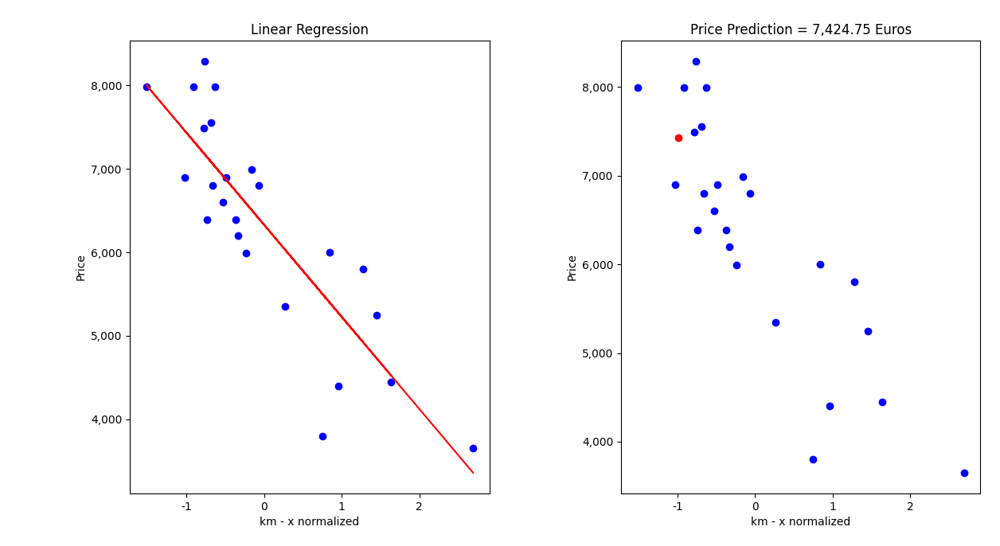

# ft_linear_regression with matrix calculation
First steps in AI and more precisely machine learning. 
Let's start with a simple algo, a program that can predict the price of a car using linear regression with a gradient algorithmVous coderez un program qui peut predire le prix d une voiture en utilisant la regression lineaire avec un algorithme du gradient 

The aim of this project is to introduce you to the basic concept behind machine learning.
For this project, you will have to create a program that predicts the price of a car by
using a linear function train with a gradient descent algorithm.
We will work on a precise example for the project, but once you’re done you will be
able to use the algorithm with any other dataset.

- add a column full of one and convert to numpy array: add_one_column()
- prediction: y_hat = X * theta -> ft_y_hat(self, x)
- simple_gradient(self, x, y):
	#ŷ = hθ(x)
	#tmp_theta(0) = (1/m)sum((hθ(x(i) ) − y(i)))
	#tmp_theta(0) = (1/m)sum((hθ(x(i) ) − y(i))) * 1 
	#tmp_theta(0) = (1/m)sum((hθ(x(i) ) − y(i))) * x0(i) // rewrite 1 as x0(i) :
	#tmp_theta(1) = (1/m)sum((hθ(x(i) ) − y(i))) * x1(i)
	#Vectorisation:
		# hθ (x) = X' * θ    // hθ (x) = θ0 + θ1 x
		# tmp_theta(j) = (1 / m) * (X' * θ - y) * X'(j)
		# tmp_theta = (1 / m) * transpose(X') * (X' * θ - y)
  - gradient descent()
	def fit_(self, x, y, thetas, alpha, max_iter, epsilon=1e-3):

